# mysql基础函数

##  字符串函数

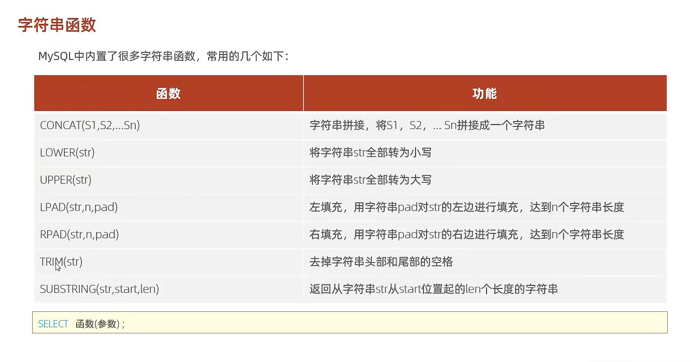

​              <u>lpad对于int类型的数据不起效果因为int不显示前面的零</u>

## 数组函数

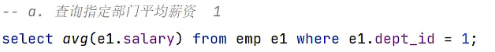

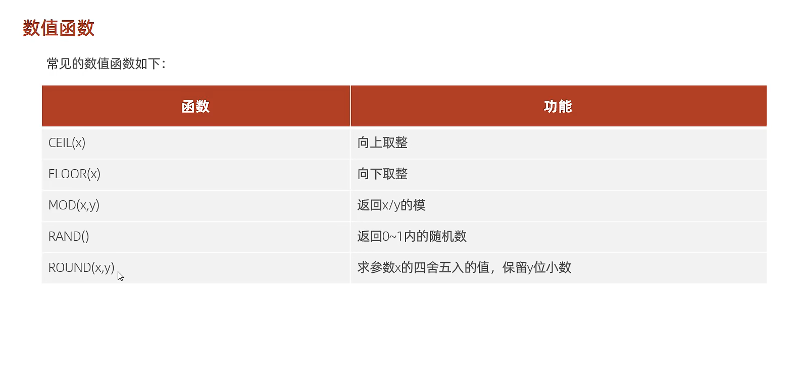

mod是取余的意思

## 日期函数

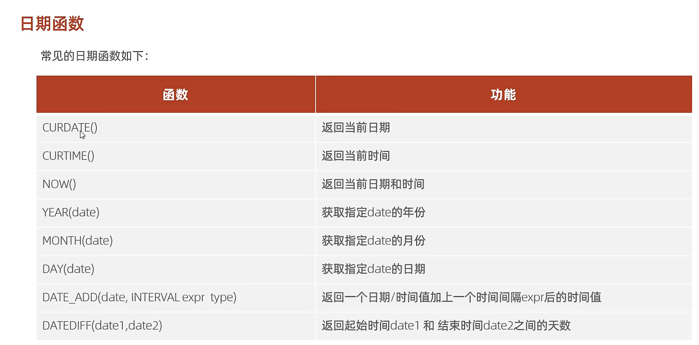

比如

`select date_add(now(),interval 70 day)`

## 约束

### 普通约束

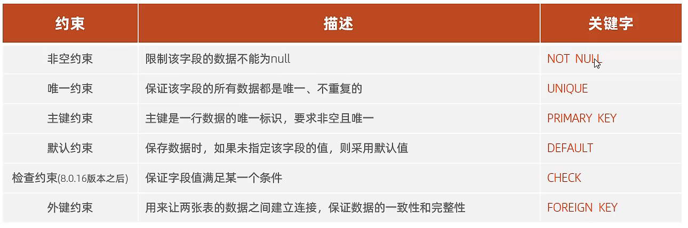

age int check(age>0&&age<=120)   check这个约束是这样用，代表年龄在0到120

status char(1) default'1'    代表如果不设置status这个值，默认为 1

id int primary key auto_increment  代表自动增长而且在这一行数据中唯一，与unique不同，unique是在这一个字段中唯一

name varchar(20) not null unique 代表唯一而且不能为空

### 外键约束

#### 添加外键

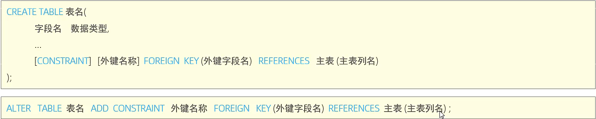

#### 删除外键

alter table 表名 drop foreign key 外键名称

#### 更新/删除时相应的父子表关系

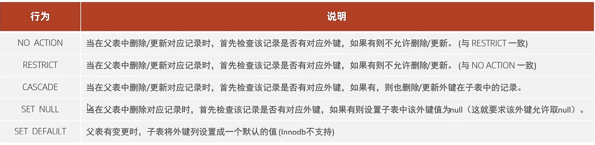

运用的语法

这个代表更新时候遵守的规则和删除时遵守的规则

## 多表查询

### 内连接

对查询结果去重只需要在select后加入distinct 比如

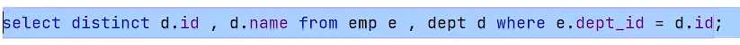

#### 隐式内连接

`select emp.name, dept.name from emp ,dept where epm.dept_id=dept.id;`

以上是查询两张表的员工名字和部门名字的代码

#### 显式内连接

`select e,name,d.name from emp e join dept d on e.dept_id=d.id`

还有另一种形式 inner可以省略

`select e,name,d.name drom emp e join dept d on e.dept_id=d.id`

### 外连接

#### 左外连接

会查询到左边这个表的全部信息纵使它不符合条件

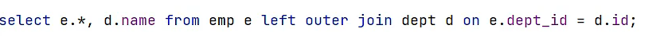

#### 右外连接

同理

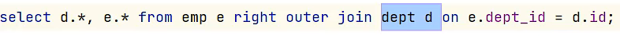

### 自连接

自连接的作用，比如下面 managerid代表了直属领导，当我们要查询每个人的领导时，需要用到自查询

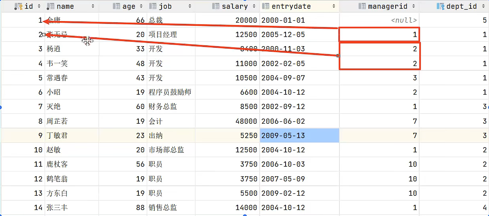

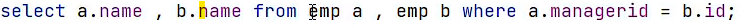

把它看成两张表更好理解,如果想要查询没有领导也可以查询出来，可以用左查询

### 内连接和外连接的区别

left join （左连接）：返回包括左表中的所有记录和右表中连接字段相等的记录。. right join （右连接）：返回包括右表中的所有记录和左表中连接字段相等的记录。. inner join （等值连接或者叫内连接）：只返回两个表中连接字段相等的行。

## 子查询

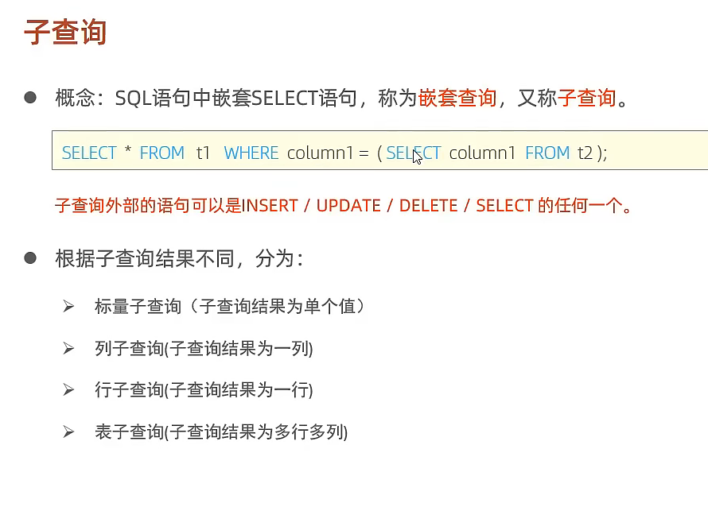

### 列子查询

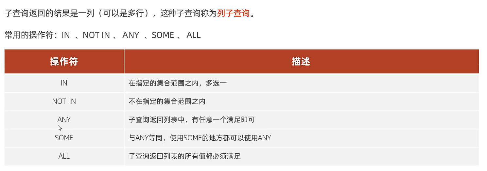

`select id from dept where name='销售部'or name='市场部'`

查询市场部和销售部的所有员工的id

`select * from emp where dept_id in (select id from dept where name='销售部'or name='市场部'`) `

### 行子查询

还有这种表现形式，行子查询

`select * from emp where (salary,managerid)=(12500,3)`

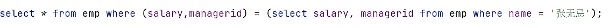

### 表子查询

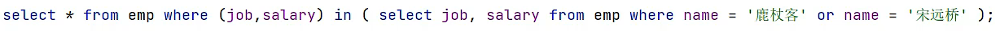

还可以把查询返回的数据当成一张表

# 事务

## 查看事务

select @@autocommit

自动提交为1，手动提交为0

## 更改事务

set @@autocommit=0

## 提交事务

commit

## 回滚事务

当发生错误时，就需要回滚事务

rollback；

还有另一种方式运用事务

## 开启事务

start transaction或者 begin

其余不变

## 事务隔离

查看事务隔离级别

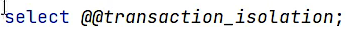

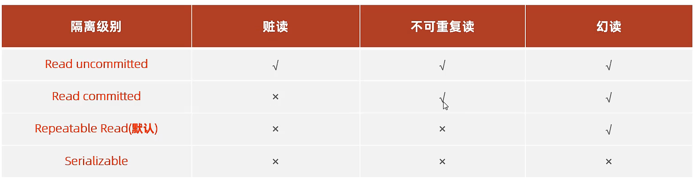

## 查看事务进程

SELECT * FROM information_schema.INNODB_TRX