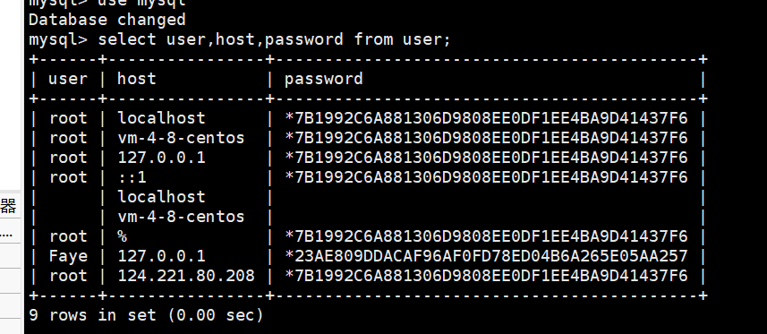

# 关于服务器MySQL权限问题

## 在MySQL的user表记录用户信息



可以用insert的方式插入新用户，但不推荐！！！因为密码显示就不会有加密直接以明文显示，推荐使用create的方法创建新用户，所有新用户都没有如何访问权限！！！


------


## 授权

创建新用户`CREATE USER '用户名'@'IP地址或者域名'  IDENTIFIED BY '*password*';`   如果是主机地址那里是%则代表任何电脑可以通过这个账号的用户名和密码登录

授予权限的基本公式

```
 grant '权限列表'  on '数据库名.表名' to  '用户名'@'主机名'
```

```
`GRANT ALL  ON *.*  TO '用户名'@'主机IP地址'  WITH GRANT OPTION;`
```

 但是all代表授予这个用户拥有任何权限

`WITH GRANT OPTION`代表可以授予其他用户权限

具体请参考 [](https://dev.mysql.com/doc/refman/5.6/en/creating-accounts.html#creating-accounts-granting-privileges)


------

## 撤销权限

revoke  '权限列表' on '数据库名.表名'  from '用户名'@'主机名'


------


## 修改密码

直接修改user表里的密码

alter user '用户名'@'主机名' identifled  with mysql_native_password by '新密码'

其中 with mysql_native表示用mysql自带的加密方式进行加密

